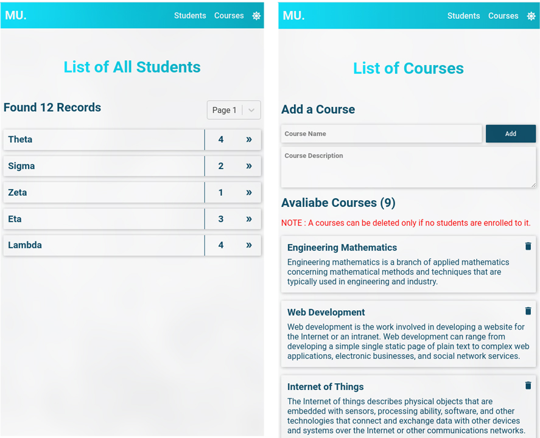

# University Administration

:zap:This is a full-stack application that is both responsive and user-friendly, designed to track and manage *students* and their *course enrollment* information using __Next.js__ (a React framework) and __Sanity.io__.

* View on [GitHub](https://github.com/SurajTC/University-Administration)
* Check out the [Live Demo](https://university-administration.vercel.app/)

---

## Index

* [About](#About)
* [Getting Started](#Getting&nbsp;Started)
* [Technical Stack](#Tech&nbsp;Stack)
  * Frontend
  * Backend
  * API
* [Screenshots](#Screenshots)

---

## About

This is a full-stack application that is both responsive and user-friendly, designed to track and manage *students* and their *course enrollment* information using __Next.js__ (a React framework) and __Sanity.io__.

## Getting&nbsp;Started

1. Cloning this repository

```sh
git clone https://github.com/SurajTC/University-Administration.git
```

2. Installing Dependencies

```sh
cd ./University-Administration/admin-frontend-next/

yarn install 
[OR]
npm install
```

3. Starting development server on localhost

```sh
yarn dev
[OR]
npm run dev
```

## Tech&nbsp;Stack

Sanity is an open-source, API-based CMS that pairs perfectly with Next.js.
Users can make serverless calls to the Sanity API in Next.js and connect their app to a performant, extensible CMS in only a few lines of code. It's the fastest, most developer-friendly way to build and ship digital content.

* ### Frontend

[__NEXT.js__](https://nextjs.org/) is an open-source development framework built on top of Node.js enabling React based web applications functionalities such as server-side rendering and generating static websites.

* ### Backend

[__Sanity.io__](https://www.sanity.io/) has a real-time datastore for structured content, and supporting APIs for assets, user management, and more.

* ### API

Next.js has support for [__API__](https://nextjs.org/docs/api-routes/introduction) Routes, which let you easily create an API endpoint as a Node.js serverless function.

## Screenshots


